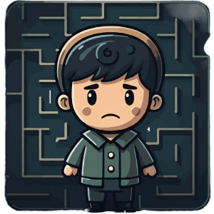

# MazeWith 🌀

<a href="https://mazewith.me/" style="text-align:center; display:block;">https://mazewith.me/</a>

**MazeWith** is a full-stack, real-time multiplayer maze game built with React & TypeScript. Players use their mobile devices as controllers to navigate the maze. The game screen displays the maze and player movements in real-time.

## 🚀 Project Overview

**MazeWith** is a multiplayer game where players control their character through a maze using their phones as controllers. The game is separated into three key components:

1. [**Website**](https://github.com/mazewith/website): Provides an introduction to the game, its features, and a guide on how to play.
2. [**Game Screen**](https://github.com/mazewith/game): Displays the maze, real-time player movement, and game status.
3. [**Controller**](https://github.com/mazewith/controller): Allows players to control their characters using their mobile devices.

---

## 🛠️ Tech Stack

### Frontend   

- **React** (TypeScript): Main framework for building the website, game screen, and controller components. It manages the game logic, dynamically generates mazes, and determines valid player movements based on the maze structure. Data is updated and re-rendered in real-time.

### Backend   

- **Firebase** (Realtime Database): Stores player positions, game state, and maze configurations.
- **Redis**: Used to track game room details such as `createdAt`, `roomId`, and `joins` for efficient real-time updates and displaying game stats like most recent and most played rooms.
- **AWS Lambda**: Handles serverless processing of game room data. When players create or join a room, the game sends the data to an AWS Lambda function, which processes it and stores it in Redis for fast retrieval.

### DevOps and Infrastructure

- **GitHub Actions**: Automated CI/CD pipeline to deploy the application.
- **Domain & SSL**: The game is hosted on a custom domain with SSL encryption, ensuring secure communication and a professional user experience. The SSL certificate was set up to provide HTTPS access, which is crucial for modern web applications.

---

## 📫 Contact

Feel free to reach out if you have any questions or suggestions for improvements!

- **Email**: [info@mazewith.me](mailto:info@mazewith.me)
